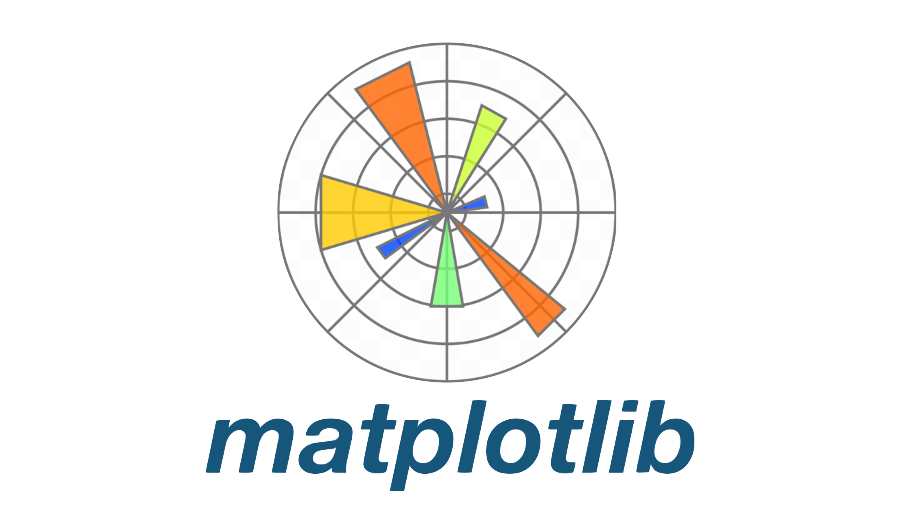

# 👋 Gabriel Urias  

🎓 Estudante de Ciência de Dados e Inteligência Artificial

🤖 Interessado em IA e Sustentabilidade

---

## 🛠️ Competências Técnicas  

    
    
    
    
    
    
    

---

## 📂 Projetos  

| Projeto | Descrição |
|---------|-----------|
| **EduConnect – Sistema de Prevenção à Evasão Escolar 📖** | Protótipo navegável em Figma |
| **WorldGuide – Aplicativo de Turismo ✈️** | Protótipo navegável em Figma |

---

## 🌍 Idiomas

- **Português**: Nativo  
- **Inglês**: Intermediário (B2 – CEFR)  
